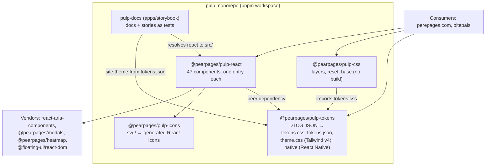
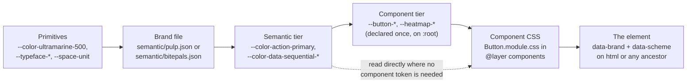
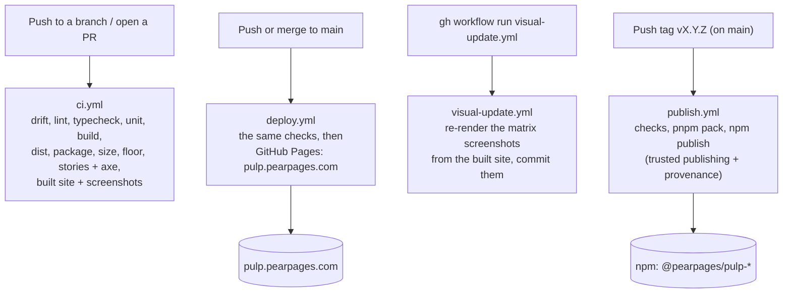

# Architecture

How pulp is built: what the packages are, how a token becomes a painted pixel, and how a change
reaches npm and the docs site. `PRINCIPLES.md` says *why* it is shaped this way, `CLAUDE.md` holds
the rules CI enforces, `docs/decisions/` the choices made along the way, and `tasks.md` what is left.

## What the repository holds

The five workspace packages, what each depends on, and who consumes the published ones.

| Path | What |
| --- | --- |
| `packages/tokens` | W3C DTCG JSON in `tokens/{primitives,semantic,component}`; `scripts/build.mjs` writes `dist/tokens.css` and `dist/tokens.json`, and two views of the semantic tier, `dist/theme.css` (Tailwind v4) and `dist/native.{js,cjs,d.ts}` (React Native), record 005. All committed; CI fails on drift |
| `packages/css` | `layers.css`, `reset.css`, `base.css`, `index.css`. No build, framework-agnostic |
| `packages/react` | components in `src/<name>/` (five files each), tsup build, one entry per component, `component-manifest.json` generated from the JSDoc |
| `packages/icons` | `svg/` sources → generated `src/icons/*.tsx` (committed; `check` fails on drift); one barrel, tree-shakeable |
| `apps/storybook` | docs and stories-as-tests (package `pulp-docs`), deployed to pulp.pearpages.com. `.storybook/theme.ts` builds the site theme from `tokens.json`; `scripts/fonts.mjs` copies the brand typefaces for the manager; `scripts/og-card.mjs` renders the share card and touch icon into `public/` |
| `.claude/skills/add-component` | the scaffold procedure for a new component |
| `docs/decisions` | decision records, rendered as the Storybook "Decisions" page |

## How a token reaches the screen

Three tiers, two axes. Components read only the semantic and component tiers, so a brand is a
swap of the file that maps primitives onto semantic names.

- `data-brand="pulp" | "bitepals"` picks palette, radius, type families and `--space-unit`
  (density). Brands nest: any element can carry the attribute.
- `data-scheme="light" | "dark"`, or none to follow the OS. Colours are `light-dark()` pairs;
  `$extensions["com.pearpages.pulp"].dark` holds a token's dark counterpart.
- The component tier is declared once, on `:root`. A brand may restate a single component token in
  `tokens/component/<brand>/<component>.json` when the value is itself brand (bitepals' buttons are
  pills); the tests hold it to the semantic layer and to names that already exist (record 007).
- `.multiply` builds the spacing scale from `space.unit`. Shadows split into `--shadow-x-color`
  (light-dark) and geometry, because `light-dark()` takes only colours.
- Per-person colour is an index into `color.accent.1…8`; density data reads the sequential scale
  `color.data.sequential.0…4`, inverted in dark so more is always brighter (record 009).

Choices the contrast tests forced, kept on purpose: text on the action fill is ink in pulp dark and
in bitepals in both schemes (white on the brand orange is 2.8:1); `color.action.text` is a separate
accent for text on surfaces (ghost buttons, links), because the bitepals fill is 2.3:1 on cream;
bitepals interaction states brighten instead of darken; faint text is promised on base and raised
surfaces only.

Cascade layers settle every conflict by order, never by specificity:
`@layer reset, tokens, vendor, base, components, utilities;`. Every stylesheet pulp ships restates
that line first, because the bundler decides which file loads first.

## Inside the React package

- **One entry per component** (`@pearpages/pulp-react/button`), each with its own stylesheet, plus a
  barrel and a combined `styles.css`. `pnpm build` stamps `"use client"` on the entries that need a
  client (decided from source by `scripts/client-entries.mjs`); the others render in a Server Component.
- **Compound parts** (`Menu.Trigger`) are also exported flat (`MenuTrigger`), the only form a Server
  Component can use from a client entry.
- **Complex widgets** (Combobox, Listbox, Picker, Calendar, DatePicker, Slider, DataGrid) build on
  React Aria Components (record 001); Dialog and Sheet on `@pearpages/modals`; Heatmap on
  `@pearpages/heatmap`. Their props never reach pulp's API, and pulp themes them by mapping tokens onto
  their CSS variables in the `vendor` layer.
- **The manifest** (`dist/component-manifest.json`) is generated from each component's JSDoc
  (`@status`, `@category`, `@accessibility`, `@do`, `@dont`) and its props. The docs page, the status
  page, the sidebar and coding agents all read it.

## From a commit to npm and the site

Which workflow runs when, and what each one guards.

The release itself: `pnpm changeset` per notable change → `pnpm version-packages` on `main` →
`pnpm verify` → push and wait for the deploy → tag `vX.Y.Z` and push the tag. Versions already on
the registry are skipped, so a package without changes is not republished.

The screenshots are rendered in CI only (text rasterises differently on macOS and Linux), from the
built site, never from Storybook's dev server: the dev transform once showed every test green while
the deployed Button was bare text.
