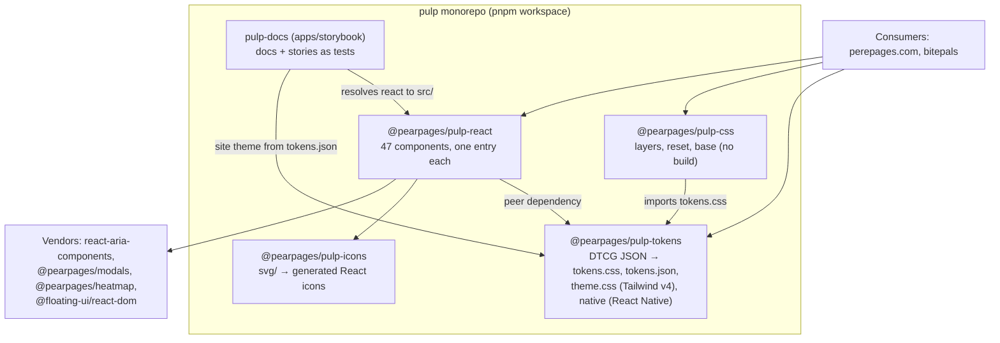
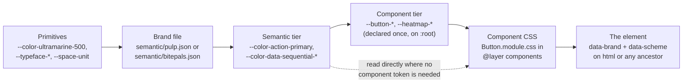
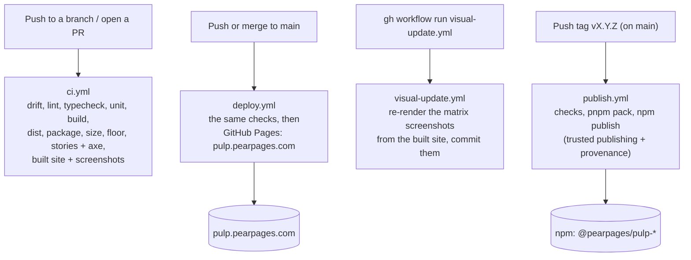

# Architecture

How pulp is built: what the packages are, how a token becomes a painted pixel, and how a change
reaches npm and the docs site. `PRINCIPLES.md` says *why* it is shaped this way, `CLAUDE.md` holds
the rules CI enforces, `docs/decisions/` the choices made along the way, and `tasks.md` what is left.

## What the repository holds

The five workspace packages, what each depends on, and who consumes the published ones.

```mermaid
flowchart TD
  subgraph repo["pulp monorepo (pnpm workspace)"]
    tokens["@pearpages/pulp-tokens<br/>DTCG JSON → tokens.css, tokens.json,<br/>theme.css (Tailwind v4), native (React Native)"]
    css["@pearpages/pulp-css<br/>layers, reset, base (no build)"]
    icons["@pearpages/pulp-icons<br/>svg/ → generated React icons"]
    react["@pearpages/pulp-react<br/>47 components, one entry each"]
    docs["pulp-docs (apps/storybook)<br/>docs + stories as tests"]
  end
  vendors["Vendors: react-aria-components,<br/>@pearpages/modals, @pearpages/heatmap,<br/>@floating-ui/react-dom"]
  consumers["Consumers: perepages.com, bitepals"]

  css -->|imports tokens.css| tokens
  react -->|peer dependency| tokens
  react --> icons
  react --> vendors
  docs -->|"resolves react to src/"| react
  docs -->|site theme from tokens.json| tokens
  consumers --> tokens
  consumers --> css
  consumers --> react
```

| Path | What |
| --- | --- |
| `packages/tokens` | W3C DTCG JSON in `tokens/{primitives,semantic,component}`; `scripts/build.mjs` writes `dist/tokens.css` and `dist/tokens.json`, and two views of the semantic tier, `dist/theme.css` (Tailwind v4) and `dist/native.{js,cjs,d.ts}` (React Native), record 005. All committed; CI fails on drift |
| `packages/css` | `layers.css`, `reset.css`, `base.css`, `index.css`. No build, framework-agnostic |
| `packages/react` | components in `src/<name>/` (five files each), tsup build, one entry per component, `component-manifest.json` generated from the JSDoc |
| `packages/icons` | `svg/` sources → generated `src/icons/*.tsx` (committed; `check` fails on drift); one barrel, tree-shakeable |
| `apps/storybook` | docs and stories-as-tests (package `pulp-docs`), deployed to pulp.pearpages.com. `.storybook/theme.ts` builds the site theme from `tokens.json`; `scripts/fonts.mjs` copies the brand typefaces for the manager; `scripts/og-card.mjs` renders the share card and touch icon into `public/` |
| `.claude/skills/add-component` | the scaffold procedure for a new component |
| `docs/decisions` | decision records, rendered as the Storybook "Decisions" page |

### What makes each generated file, and whether it is ours

*Standard* is an off-the-shelf tool used as documented; *bespoke* is a script in this repo that pulp
maintains. The committed token and icon outputs are checked for drift by re-rendering them in
memory (`--check`), which is bespoke too: build and check are one function, so they cannot disagree.

| Artefact | Made by | Why |
| --- | --- | --- |
| `tokens.css`, `tokens.json` | Standard engine, bespoke output: Style Dictionary 5 reads and resolves the DTCG, pulp's formats (`packages/tokens/scripts/format.mjs`) write | No built-in format emits `light-dark()` and `calc()` from pulp's two `$extensions`, the per-brand blocks or the manifest's fields; resolving references is not pulp-specific, so it is not rewritten (record 014) |
| `theme.css`, `native.{js,cjs,d.ts}` | Bespoke: `packages/tokens/scripts/outputs.mjs` | A filter and rename over the finished `tokens.json`, across brands, where Style Dictionary builds one brand at a time (records 005, 014) |
| `packages/icons/src/icons/*.tsx` | Bespoke: `packages/icons/scripts/generate.mjs` | The SVGs are stroke-only simple shapes by rule, so the JSX translation is a few lines and needs no SVG toolchain |
| `packages/react/dist` (JS, types, CSS) | Standard: tsup (esbuild), `local-css` loader | Nothing pulp-specific in bundling; one entry per component is tsup configuration |
| `"use client"` on client entries | Bespoke: `packages/react/scripts/client-entries.mjs`, run after tsup | Decided from each entry's imports, so the fact has one source, the code; its `CLIENT_PACKAGES` list is kept by hand (record 015) |
| `dist/component-manifest.json` | Standard parser, bespoke manifest: `react-docgen-typescript` reads the props, `packages/react/scripts/manifest.mjs` validates the JSDoc tags and adds `client`, `flat`, `tokens`, `requires` | The tags (`@status`, `@category`, `@accessibility`, `@do`, `@dont`) are pulp's contract with its docs and with agents, checked at build and shipped in the package. Storybook 10's own `componentsManifest` is not enabled: it carries the tags raw, unchecked, and only in the site (record 016) |
| `storybook-static` | Standard: Storybook 10 | The docs site; pulp adds a link check (`check-links.mjs`) and the built-site test (`check-built-site.mjs`) |
| `public/og.png`, `apple-touch-icon.png`, manager fonts | Bespoke: `apps/storybook/scripts/og-card.mjs` (drives Playwright), `fonts.mjs` (copies from fontsource) | Rendered from `tokens.css` and the brand typefaces. The PNGs are committed and re-run by hand after a brand change, with no drift check; the fonts are copied at build and not committed |
| `CHANGELOG.md`, versions | Standard: Changesets | The GitHub Release notes are bespoke (`scripts/release-notes.mjs`), cut from those changelogs |

## How a token reaches the screen

Three tiers, two axes. Components read only the semantic and component tiers, so a brand is a
swap of the file that maps primitives onto semantic names.

```mermaid
flowchart LR
  prim["Primitives<br/>--color-ultramarine-500,<br/>--typeface-*, --space-unit"]
  brand["Brand file<br/>semantic/pulp.json or<br/>semantic/bitepals.json"]
  sem["Semantic tier<br/>--color-action-primary,<br/>--color-data-sequential-*"]
  comp["Component tier<br/>--button-*, --heatmap-*<br/>(declared once, on :root)"]
  css["Component CSS<br/>Button.module.css in<br/>@layer components"]
  dom["The element<br/>data-brand + data-scheme<br/>on html or any ancestor"]

  prim --> brand --> sem --> comp --> css --> dom
  sem -.->|"read directly where no<br/>component token is needed"| css
```

- `data-brand="pulp" | "bitepals"` picks palette, radius, type families and `--space-unit`
  (density). Brands nest: any element can carry the attribute.
- `data-scheme="light" | "dark"`, or none to follow the OS. Colours are `light-dark()` pairs;
  `$extensions["com.pearpages.pulp"].dark` holds a token's dark counterpart.
- The component tier is declared once, on `:root`. A brand may restate a single component token in
  `tokens/component/<brand>/<component>.json` when the value is itself brand (bitepals' buttons are
  pills); the tests hold it to the semantic layer and to names that already exist (record 007).
- `.multiply` builds the spacing scale from `space.unit`. Shadows split into `--shadow-x-color`
  (light-dark) and geometry, because `light-dark()` takes only colours.
- Per-person colour is an index into `color.accent.1…8`; density data reads the sequential scale
  `color.data.sequential.0…4`, inverted in dark so more is always brighter (record 009).

Choices the contrast tests forced, kept on purpose: text on the action fill is ink in pulp dark and
in bitepals in both schemes (white on the brand orange is 2.8:1); `color.action.text` is a separate
accent for text on surfaces (ghost buttons, links), because the bitepals fill is 2.3:1 on cream;
bitepals interaction states brighten instead of darken; faint text is promised on base and raised
surfaces only.

Cascade layers settle every conflict by order, never by specificity:
`@layer reset, tokens, vendor, base, components, utilities;`. Every stylesheet pulp ships restates
that line first, because the bundler decides which file loads first.

## Inside the React package

- **One entry per component** (`@pearpages/pulp-react/button`), each with its own stylesheet, plus a
  barrel and a combined `styles.css`. `pnpm build` stamps `"use client"` on the entries that need a
  client (decided from source by `scripts/client-entries.mjs`, record 015); the others render in a
  Server Component.
- **Compound parts** (`Menu.Trigger`) are also exported flat (`MenuTrigger`), the only form a Server
  Component can use from a client entry.
- **Complex widgets** (Combobox, Listbox, Picker, Calendar, DatePicker, Slider, DataGrid) build on
  React Aria Components (record 001); Slider is the pilot for moving them to Ark UI (record 011).
  Dialog and Sheet build on `@pearpages/modals`; Heatmap on `@pearpages/heatmap`. Their props never reach pulp's API, and pulp themes them by mapping tokens onto
  their CSS variables in the `vendor` layer.
- **The manifest** (`dist/component-manifest.json`) is generated from each component's JSDoc
  (`@status`, `@category`, `@accessibility`, `@do`, `@dont`) and its props. The docs page, the status
  page, the sidebar and coding agents all read it.

## From a commit to npm and the site

Which workflow runs when, and what each one guards.

```mermaid
flowchart TD
  branch["Push to a branch / open a PR"] --> ci["ci.yml<br/>drift, lint, typecheck, unit, build,<br/>dist, package, size, floor, stories + axe,<br/>built site + screenshots"]
  main["Push or merge to main"] --> deploy["deploy.yml<br/>the same checks, then<br/>GitHub Pages: pulp.pearpages.com"]
  dispatch["gh workflow run visual-update.yml"] --> visual["visual-update.yml<br/>re-render the matrix screenshots<br/>from the built site, commit them"]
  tag["Push tag vX.Y.Z (on main)"] --> publish["publish.yml<br/>checks, pnpm pack, npm publish<br/>(trusted publishing + provenance)"]
  publish --> npm[("npm: @pearpages/pulp-*")]
  deploy --> site[("pulp.pearpages.com")]
```

The release itself: `pnpm changeset` per notable change → `pnpm version-packages` on `main` →
`pnpm verify` → push and wait for the deploy → tag `vX.Y.Z` and push the tag. Versions already on
the registry are skipped, so a package without changes is not republished.

The screenshots are rendered in CI only (text rasterises differently on macOS and Linux), from the
built site, never from Storybook's dev server: the dev transform once showed every test green while
the deployed Button was bare text.
